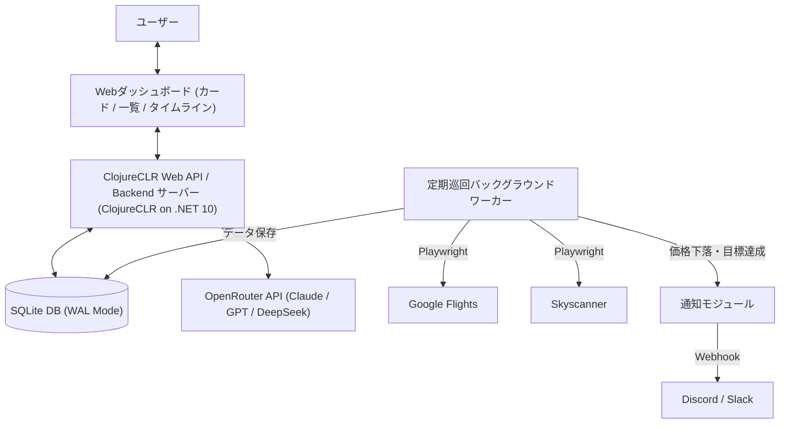

# システム仕様書 (System Specification) - FlightTrackerAI

本書は、航空券自動巡回・価格監視・AI支援システム「**FlightTrackerAI**」の機能要件、外部インターフェース、画面およびAPI仕様を定義するシステム仕様書です。

---

## 1. システム概要とスコープ

### 1.1 目的

旅行者・出張者が指定したフライト条件（日程・区間・許容乗継・予算・航空会社など）に基づき、Google Flights および Skyscanner をヘッドレスブラウザで自動巡回して価格変動を追跡・蓄積し、目標価格到達や大幅下落時のWebhook通知、ならびにOpenRouter（LLM）を用いた自然言語解析および買い時分析・レコメンドを提供する。

### 1.2 システム構成図

---

## 2. ユースケース一覧

| UC-ID     | ユースケース名                     | 概要                                                                                                                   | アクター          |
| :-------- | :--------------------------------- | :--------------------------------------------------------------------------------------------------------------------- | :---------------- |
| **UC-01** | パラメータ直接指定によるタスク登録 | 出発地・目的地、往復/片道、日程、航空会社、目標価格、巡回間隔（デフォルト12h）を入力して登録                           | ユーザー          |
| **UC-02** | AI自然言語によるタスク登録補助     | 「来年GWに羽田発パリ往復で20万以下」と入力し、AIが抽出した構造化条件をフォームに流し込んで確認・登録                   | ユーザー          |
| **UC-03** | 監視タスク一覧・管理               | カード形式 / Excel風リスト形式の切り替え、複数航空会社（往復別・乗継別）のバッジ確認、即時巡回、設定編集、削除         | ユーザー          |
| **UC-04** | 便詳細・旅程タイムラインの確認     | 複数航空会社を使った乗継便や往復別航空会社の詳細セグメント（便名・乗継時間・運航会社）および時系列価格推移グラフを閲覧 | ユーザー          |
| **UC-05** | システム全体設定の管理             | デフォルト巡回間隔（3h/6h/12h/24h）、グローバルWebhook URL、OpenRouter APIキーの設定                                   | ユーザー          |
| **UC-06** | 自動巡回と価格記録                 | バックグラウンドで定期巡回し、複数便および各区間セグメントをDBに記録。出発日超過タスクは自動完了へ遷移                 | システム          |
| **UC-07** | 価格急落・目標達成通知             | 巡回時に前回比下落または目標価格達成を検知した場合、Discord/Slackへ通知を送信                                          | システム          |
| **UC-08** | AI価格分析・レコメンド             | 現在の価格水準が買い時か様子見かをAIが要約し、画面上で提示                                                             | ユーザー/システム |
| **UC-09** | クイックメモ編集                   | カード・リスト行からモーダルを開き、タスク要望メモ（User Notes）をインライン即時更新                                   | ユーザー          |
| **UC-10** | 有頭手動支援ガイダンス             | Bot検知（PRESS & HOLD）発生時にWebUI上で解除カウントダウンとブラウザ操作を案内し巡回復帰                               | ユーザー/システム |
| **UC-11** | エラー時リカバリ・再試行           | 巡回エラー時の人間向け理由表示および「今すぐ再試行」による能動的リカバリ実行                                           | ユーザー          |

---

## 3. 機能要件詳細

### 3.1 監視タスク管理機能 (Watch Task Management)

- **登録項目**:
  - `Title`: タスク名（任意）
  - `Origin`: 出発地（IATAコード / 都市名サジェスト）
  - `Destination`: 目的地（IATAコード / 都市名サジェスト）
  - `TripType`: 往復 (`RoundTrip`) または 片道 (`OneWay`)
  - `OutboundDate`: 往路出発日 (`YYYY-MM-DD`)
  - `InboundDate`: 復路出発日 (`YYYY-MM-DD`、片道時はNULL)
  - `PreferredAirlines`: 優先・指定航空会社（複数指定可）
  - `MaxStops`: 許容乗継回数 (直行のみ: `0`, 1回以下: `1`, 指定なし: `Any`)
  - `TargetPrice`: 目標アラート価格 (JPY、整数、任意)
  - `CheckIntervalHours`: 巡回間隔（未指定時はシステム全体のデフォルト巡回間隔を採用）
  - `NotificationWebhookUrl`: 個別Webhook URL (未指定時はグローバル設定URLを使用)

### 3.2 複数航空会社（トランジット・往復別社）のデータ構造と表示仕様

1つの旅程で複数の航空会社が関与する以下の全パターンに対応します:

1. **往復別航空会社**: 往路がJAL、復路がエールフランスなど
2. **乗継（トランジット）別航空会社**: 第1区間がANA、第2区間がシンガポール航空など
3. **コードシェア（共同運航）**: 販売元と実際の運航会社（Operating Carrier）が異なる場合

- **カード / 一覧リスト表示**:
  - 複数会社が関与する場合、`JAL / エールフランス` や `複数社 (ANA + SQ)` のように明記。
- **詳細モーダル（旅程タイムライン）**:
  - 往路（Outbound）と復路（Inbound）をブロック分離。
  - 各フライトセグメントごとに「航空会社名」「便名」「出発/到着時刻・空港」「所要時間」「乗継地での待ち時間（レイオーバー時間）」を視覚的タイムラインで表示。

### 3.3 グローバル設定管理機能 (System Settings)

- アプリケーション全体で共通保持する設定項目:
  - `DefaultCheckIntervalHours`: 新規タスクのデフォルト巡回間隔（デフォルト: **12時間**、設定変更可能: 3h, 6h, 12h, 24h, 任意）
  - `DefaultWebhookUrl`: グローバル通知先 Discord/Slack Webhook URL
  - `OpenRouterApiKey`: AI支援用 OpenRouter API キー
  - `ScrapingProvidersEnabled`: Google Flights / Skyscanner の巡回有効フラグ

### 3.4 自動巡回・スクレイピング機能 (Scraping Engine)

- **対象**: Google Flights & Skyscanner
- **複数便・複数セグメントの取得**:
  - 最安上位複数便（5〜10件）の便情報と、各便のフライトセグメント（全区間の航空会社・便名・時間）をパースして保存。
- **ブラウザプロファイル永続化 & 排他制御**:
  - `doc/work/browser_profile/` をユーザーデータディレクトリとして永続化し、PerimeterX / Kasada の検証済みセッションCookie（`_px3`, `_pxhd` 等）やストレージを保持。
  - `SemaphoreSlim(1, 1)` による巡回実行の排他制御（`SingletonLock` 競合防止）。
- **アンチBot対策 & 耐障害性**:
  - `navigator.webdriver` 偽装、Cookie自動承諾、ランダムジッター、タイムアウト＆指数バックオフ。
  - Skyscanner における 2段階アクセス（公式トップページ事前ウォームアップ ➔ Referer 保持ナビゲーション）。
  - `PRESS & HOLD` チャレンジ検知時の中心座標自動長押し試行（5.5秒）および有頭手動支援モード（最大60秒待機）のシームレス連携。

### 3.5 時刻・タイムゾーン統一表示仕様 (Timezone & Schedule Standard)

システム全体で取り扱う日時は、航空業界標準およびユーザー体験に基づいて以下のように厳密に統一定義する:

1. **フライト発着時刻 (Flight Departure & Arrival Times)**:
   - 全世界共通の航空券表示規約に従い、**「各発着空港の現地ローカル時刻 (Local Time)」** で統一表示する。
   - 出発時刻: 出発空港の現地時間（例: HND 10:35）
   - 到着時刻: 到着空港の現地時間（例: CDG 07:15(+1) ※翌日到着は `(+1)`、2日後到着は `(+2)`）
2. **システムデータ取得日時・更新ログ (Captured & Updated Timestamps)**:
   - **ユーザー環境（日本標準時 JST / `Asia/Tokyo`）** で統一表示する（例: `08/29 14:00 (JST)`）。
3. **フライト所要時間・乗継待機時間 (Flight Durations & Layovers)**:
   - 発着空港間のタイムゾーン時差（UTC Offset）を正しく加味して計算した **「正味の実経過時間 (Elapsed Time)」** を表示する（例: 総所要時間 `22h 40m`、SIN乗継待機 `2h 15m`）。

---

## 4. Web 画面仕様 (UI Wireframe / Structure)

- **メイン画面構成**:
  1. **ヘッダー**: タイトル、ワーカー稼働ステータス、システム設定ボタン（⚙）、新規タスク登録ボタン
  2. **AIアシスタント入力エリア**: 構造化テキスト/自然文入力、テンプレート挿入ボタン（箇条書き/YAML/自然文）、AI解析実行、新規タスク登録モーダルへの自動流し込み補完
  3. **有頭手動支援ガイダンスバナー**: Bot検知（PRESS & HOLD）発生時の解除カウントダウン案内（最大60秒）および復帰トースト通知
  4. **表示切替 & フィルタ**: [🗂 カード表示] / [📊 リスト一覧表示]、ステータスタブ、インクリメンタル検索、アクティブフィルタチップバー（個別・一括クリア）
  5. **カード表示**: 区間（空港名）、日程、最安価格、**複数航空会社表記（例: `ANA + シンガポール航空`）**、ユーザーメモ、データ取得日時、即時巡回/再試行ボタン
  6. **Excel風リスト表示**:
     - 情報の充実: IATAコードに加え空港通称名を表示、日程に発着時刻（例: `05/01(金) 10:35 → 07:15(+1)`）を表示、ユーザーメモ欄を配置
     - 列絞り込み（ステータス、区間、航空会社、価格、更新日時）、ソート機能
  7. **詳細モーダル**:
     - 価格推移グラフ（Chart.js）
     - AI買い時分析サマリー（キャッシュ保持・表示）
     - **旅程タイムライン（乗継・往復の全セグメント航空会社・便名・待ち時間を図示）**
     - 最新取得便一覧比較テーブル
  8. **システム設定モーダル**: デフォルト巡回間隔（12h等）、グローバルWebhook URL、OpenRouter APIキー
  9. **タスク編集・クイックメモ編集モーダル / 削除確認ダイアログ / トースト通知 / 空状態画面 (0件時)**

### 4.1 モーダルナビゲーションおよびライフサイクル仕様 (Modal Navigation & Lifecycle)

ユーザーがモーダル画面から迷子にならず、安全かつ直感的に前の親画面（ダッシュボード）へ戻れるよう、以下のUI・ライフサイクル規約をシステム全体で統一適用する:

1. **閉じる導線の一貫性と完全性**:
   - 右上の「×」ボタン、フッターの「キャンセル」「閉じる」ボタン、モーダル背景（外側暗色部）のクリック、および `ESC` キー押下のいずれでも確実にモーダルが閉じて親画面に戻れること。
   - **入力系モーダル（新規登録・編集・全体設定）のダーティフォーム保護**:
     - フォームの各項目が「初期表示時の値から変更されている場合（ダーティ状態）」、背景の誤クリックによる即時破棄を防止し、明示的な「キャンセル」「×」ボタン押下を要求する。初期状態から変更がない場合は背景クリックでも即座にクローズ可能とする。
     - **IME入力中（日本語変換確定前）の保護**: 日本語入力で変換取り消し等のためにESCキーが押された場合（`e.isComposing`）、モーダルの即時クローズを抑止し、入力中の内容を安全に保護する。
   - **閲覧系モーダル（旅程タイムライン詳細、システムログ確認）**:
     - 情報閲覧を主目的とするため、背景クリック、ESCキー、×ボタン、および**画面最下部までスクロールした後に戻る手間を省くフッター「閉じる」ボタン**のいずれでも即座に親画面へ復帰できる。
   - **背面スクロールロック (Scroll Lock)**:
     - モーダル表示中は背面ダッシュボードのスクロールを抑制（`document.body` に `overflow-hidden` を適用）し、クローズ時に解除する。

2. **ブラウザ履歴（History API / PopState）連動ナビゲーション**:
   - モーダル展開時（新規登録、タスク設定変更、旅程詳細、全体設定、クイックメモ、削除確認の全モーダル）に `history.pushState({ modalOpen: true }, '', '#modal')` を発行し、ブラウザの履歴スタックと同期する。
   - ユーザーがブラウザの「戻る」ボタン、マウスの戻るボタン、スマートフォン/タブレットのスワイプ戻る操作を行った場合、外部ページへ離脱することなく、`popstate` イベントによりモーダルが安全に閉じて前の親画面に復帰する。
   - UI操作（×ボタン、キャンセル、背景クリック、ESC、保存成功）でモーダルを閉じた際も `history.back()` で履歴スタックを整合させ、その後にブラウザ「戻る」を押した際の空振り（ゾンビ履歴）や2回押さないと戻れない不具合を完全に防止する。
   - ページ初期ロード時、URLにゾンビハッシュ（`#modal`）が残存している場合は安全にサニタイズ（`history.replaceState`）する。

3. **フォーム送信ライフサイクルとエラーハンドリング**:
   - **送信成功時 (HTTP 200 OK)**:
     - サーバーからレスポンスヘッダー `HX-Trigger: closeModal` を発行し、クライアント側でイベントを受信してモーダルを自動クローズする。ダッシュボードが最新状態に更新され、成功トーストが表示される。
   - **バリデーションエラー・送信失敗時 (HTTP 400 Bad Request 等)**:
     - モーダルを**閉じずに開いた状態を維持**し、モーダル内にインラインでエラー理由（赤字）を表示する。ユーザーが苦労して入力した日程・区間・メモ等のデータを一切消失させず、その場で修正して再送信できる。
     - エラー発生時は最初のエラー入力項目へ自動フォーカス（Focus Management）を行い、修正箇所を視覚的に明示する。

4. **AI自然言語解析のモーダル直接展開仕様**:
   - AI入力エリアの「AIで解析して新規登録フォームに反映」実行時、別タブでのスタンドアロン画面遷移ではなく、ダッシュボード上の新規登録モーダルへ直接フォーム値を展開して表示する。
   - LLM呼び出し中はスピナー等のローディング表示を行い、ボタン連打による多重リクエストを抑止する。
   - 万一の解析失敗時も入力テキストエリアのプロンプトを消去せず保持し、トースト通知および再試行導線を提示する。
