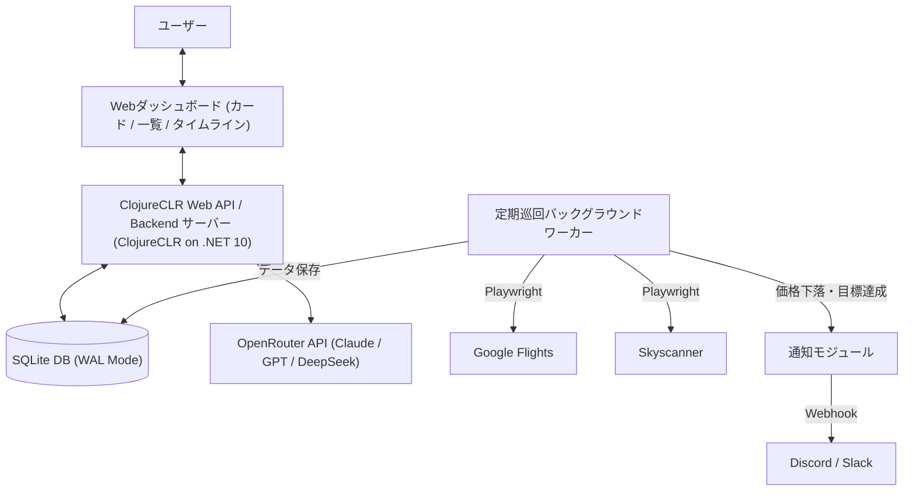

# システム仕様書 (System Specification) - FlightTrackerAI

本書は、航空券自動巡回・価格監視・AI支援システム「**FlightTrackerAI**」の機能要件、外部インターフェース、画面およびAPI仕様を定義するシステム仕様書です。

---

## 1. システム概要とスコープ

### 1.1 目的

旅行者・出張者が指定したフライト条件（日程・区間・許容乗継・予算・航空会社など）に基づき、Google Flights および Skyscanner をヘッドレスブラウザで自動巡回して価格変動を追跡・蓄積し、目標価格到達や大幅下落時のWebhook通知、ならびにOpenRouter（LLM）を用いた自然言語解析および買い時分析・レコメンドを提供する。

### 1.2 システム構成図

---

## 2. ユースケース一覧

| UC-ID     | ユースケース名                     | 概要                                                                                                                   | アクター          |
| :-------- | :--------------------------------- | :--------------------------------------------------------------------------------------------------------------------- | :---------------- |
| **UC-01** | パラメータ直接指定によるタスク登録 | 出発地・目的地、往復/片道、日程、航空会社、目標価格、巡回間隔（デフォルト12h）を入力して登録                           | ユーザー          |
| **UC-02** | AI自然言語によるタスク登録補助     | 「来年GWに羽田発パリ往復で20万以下」と入力し、AIが抽出した構造化条件をフォームに流し込んで確認・登録                   | ユーザー          |
| **UC-03** | 監視タスク一覧・管理               | カード形式 / Excel風リスト形式の切り替え、複数航空会社（往復別・乗継別）のバッジ確認、即時巡回、設定編集、削除         | ユーザー          |
| **UC-04** | 便詳細・旅程タイムラインの確認     | 複数航空会社を使った乗継便や往復別航空会社の詳細セグメント（便名・乗継時間・運航会社）および時系列価格推移グラフを閲覧 | ユーザー          |
| **UC-05** | システム全体設定の管理             | デフォルト巡回間隔（3h/6h/12h/24h）、グローバルWebhook URL、OpenRouter APIキーの設定                                   | ユーザー          |
| **UC-06** | 自動巡回と価格記録                 | バックグラウンドで定期巡回し、複数便および各区間セグメントをDBに記録。出発日超過タスクは自動完了へ遷移                 | システム          |
| **UC-07** | 価格急落・目標達成通知             | 巡回時に前回比下落または目標価格達成を検知した場合、Discord/Slackへ通知を送信                                          | システム          |
| **UC-08** | AI価格分析・レコメンド             | 現在の価格水準が買い時か様子見かをAIが要約し、画面上で提示                                                             | ユーザー/システム |
| **UC-09** | クイックメモ編集                   | カード・リスト行からモーダルを開き、タスク要望メモ（User Notes）をインライン即時更新                                   | ユーザー          |
| **UC-10** | 有頭手動支援ガイダンス             | Bot検知（PRESS & HOLD）発生時にWebUI上で解除カウントダウンとブラウザ操作を案内し巡回復帰                               | ユーザー/システム |
| **UC-11** | エラー時リカバリ・再試行           | 巡回エラー時の人間向け理由表示および「今すぐ再試行」による能動的リカバリ実行                                           | ユーザー          |

---

## 3. 機能要件詳細

### 3.1 監視タスク管理機能 (Watch Task Management)

- **登録項目**:
  - `Title`: タスク名（任意）
  - `Origin`: 出発地（IATAコード / 都市名サジェスト）
  - `Destination`: 目的地（IATAコード / 都市名サジェスト）
  - `TripType`: 往復 (`RoundTrip`) または 片道 (`OneWay`)
  - `OutboundDate`: 往路出発日 (`YYYY-MM-DD`)
  - `InboundDate`: 復路出発日 (`YYYY-MM-DD`、片道時はNULL)
  - `PreferredAirlines`: 優先・指定航空会社（複数指定可）
  - `MaxStops`: 許容乗継回数 (直行のみ: `0`, 1回以下: `1`, 指定なし: `Any`)
  - `TargetPrice`: 目標アラート価格 (JPY、整数、任意)
  - `CheckIntervalHours`: 巡回間隔（未指定時はシステム全体のデフォルト巡回間隔を採用）
  - `NotificationWebhookUrl`: 個別Webhook URL (未指定時はグローバル設定URLを使用)

### 3.2 複数航空会社（トランジット・往復別社）のデータ構造と表示仕様

1つの旅程で複数の航空会社が関与する以下の全パターンに対応します:

1. **往復別航空会社**: 往路がJAL、復路がエールフランスなど
2. **乗継（トランジット）別航空会社**: 第1区間がANA、第2区間がシンガポール航空など
3. **コードシェア（共同運航）**: 販売元と実際の運航会社（Operating Carrier）が異なる場合

- **カード / 一覧リスト表示**:
  - 複数会社が関与する場合、`JAL / エールフランス` や `複数社 (ANA + SQ)` のように明記。
- **詳細モーダル（旅程タイムライン）**:
  - 往路（Outbound）と復路（Inbound）をブロック分離。
  - 各フライトセグメントごとに「航空会社名」「便名」「出発/到着時刻・空港」「所要時間」「乗継地での待ち時間（レイオーバー時間）」を視覚的タイムラインで表示。

### 3.3 グローバル設定管理機能 (System Settings)

- アプリケーション全体で共通保持する設定項目:
  - `DefaultCheckIntervalHours`: 新規タスクのデフォルト巡回間隔（デフォルト: **12時間**、設定変更可能: 3h, 6h, 12h, 24h, 任意）
  - `DefaultWebhookUrl`: グローバル通知先 Discord/Slack Webhook URL
  - `OpenRouterApiKey`: AI支援用 OpenRouter API キー
  - `ScrapingProvidersEnabled`: Google Flights / Skyscanner の巡回有効フラグ

### 3.4 自動巡回・スクレイピング機能 (Scraping Engine)

- **対象**: Google Flights & Skyscanner
- **複数便・複数セグメントの取得**:
  - 最安上位複数便（5〜10件）の便情報と、各便のフライトセグメント（全区間の航空会社・便名・時間）をパースして保存。
- **ブラウザプロファイル永続化 & 排他制御**:
  - `doc/work/browser_profile/` をユーザーデータディレクトリとして永続化し、PerimeterX / Kasada の検証済みセッションCookie（`_px3`, `_pxhd` 等）やストレージを保持。
  - `SemaphoreSlim(1, 1)` による巡回実行の排他制御（`SingletonLock` 競合防止）。
- **アンチBot対策 & 耐障害性**:
  - `navigator.webdriver` 偽装、Cookie自動承諾、ランダムジッター、タイムアウト＆指数バックオフ。
  - Skyscanner における 2段階アクセス（公式トップページ事前ウォームアップ ➔ Referer 保持ナビゲーション）。
  - `PRESS & HOLD` チャレンジ検知時の中心座標自動長押し試行（5.5秒）および有頭手動支援モード（最大60秒待機）のシームレス連携。

### 3.5 時刻・タイムゾーン統一表示仕様 (Timezone & Schedule Standard)

システム全体で取り扱う日時は、航空業界標準およびユーザー体験に基づいて以下のように厳密に統一定義する:

1. **フライト発着時刻 (Flight Departure & Arrival Times)**:
   - 全世界共通の航空券表示規約に従い、**「各発着空港の現地ローカル時刻 (Local Time)」** で統一表示する。
   - 出発時刻: 出発空港の現地時間（例: HND 10:35）
   - 到着時刻: 到着空港の現地時間（例: CDG 07:15(+1) ※翌日到着は `(+1)`、2日後到着は `(+2)`）
2. **システムデータ取得日時・更新ログ (Captured & Updated Timestamps)**:
   - **ユーザー環境（日本標準時 JST / `Asia/Tokyo`）** で統一表示する（例: `08/29 14:00 (JST)`）。
3. **フライト所要時間・乗継待機時間 (Flight Durations & Layovers)**:
   - 発着空港間のタイムゾーン時差（UTC Offset）を正しく加味して計算した **「正味の実経過時間 (Elapsed Time)」** を表示する（例: 総所要時間 `22h 40m`、SIN乗継待機 `2h 15m`）。

---

## 4. Web 画面仕様 (UI Wireframe / Structure) - 元リポジトリ (FlightTrackerAI) 準拠

システム全体のビジュアルデザイン、レイアウト、コンポーネント構成、HTMX インタラクション、各種機能は、正常稼働リファレンス実装である `D:\programming\repos\MyGitHubRepos\FlightTrackerAI` (F#版) に 100% 厳格準拠する。

### 4.0 共通UI基盤・スタイル標準

- **デザインシステム・カラー**: Tailwind CSS。ダークテーマベース（`bg-slate-900`, `text-slate-100`, `bg-slate-950`）。
- **カスタムスタイル & アニメーション**:
  - `pulse-subtle` / `animate-pulse-subtle`: 稼働中インジケーター等の洗練されたパルス。
  - `.badge-google`: `#064e3b` 背景、`#34d399` テキスト、`#059669` ボーダー（Google Flights 用バッジ）。
  - `.badge-skyscanner`: `#0c4a6e` 背景、`#38bdf8` テキスト、`#0284c7` ボーダー（Skyscanner 用バッジ）。
- **アイコン標準**: **FontAwesome 6.5.1** (`https://cdnjs.cloudflare.com/ajax/libs/font-awesome/6.5.1/css/all.min.css`) を全面統一採用。HTMX による部分置換時にも一切のちらつきやアイコン欠落がなく、100% 確実に描画される。
- **UIライブラリ**: **HTMX 1.9.12**, **Chart.js**。
- **フォント**: サンセリフ系 (`font-sans antialiased`)、数値・コード表示部は等幅フォント (`font-mono`)。

### 4.1 メイン画面構成

1. **ヘッダー (Header)**:
   - 左部: 飛行機ロゴ (`fa-plane`、スカイブルー背景角丸アイコン)、タイトル「FlightTracker**AI**」（AI部は `text-sky-400`）、サブタイトル「Google Flights & Skyscanner 自動巡回・価格監視」。
   - 右部:
     - 巡回ワーカー稼働ステータスバッジ（緑色パルスインジケーター、「巡回ワーカー: 稼働中」）。
     - **ログ確認ボタン** (`fa-terminal` + 「ログ確認」、`/api/logs/modal` ➔ `#modal-container`)。
     - **全体設定ボタン** (`fa-sliders` + 「全体設定」、`/api/settings/modal` ➔ `#modal-container`)。
     - **新規タスク登録ボタン** (`fa-plus` + 「新規タスク登録」、`/api/tasks/new-modal` ➔ `#modal-container`)。
2. **AI 構造化文書・自然言語解析アシスタントボックス**:
   - `fa-wand-magic-sparkles` アイコン、タイトル。
   - テンプレート入力ボタン（「箇条書き」「YAML形式」「自然文」）。
   - 自由記述テキストエリア（等幅フォント、複数行、プレースホルダー付き）。
   - **「AIで解析して新規登録フォームに反映」ボタン** (`fa-wand-magic`):
     - クリック時、ポップアップブロッカーを回避して即座に別タブで飛行機アニメーション付きローディングUIを展開。
     - OpenRouter による自然言語解析（`/api/ai/parse`）完了後、抽出されたパラメータ（出発地、目的地、日程、予算等）が自動入力された新規登録画面（`/tasks/new?...`）に遷移。
3. **コントロールバー (Controls Bar)**:
   - **ステータスタブ**: 「すべて (N)」「監視中 (N)」「一時停止 (N)」「完了/エラー (N)」。HTMX (`hx-get="/api/tasks/view?mode=...&status=..."`) で `#dashboard-container` を即時部分置換。
   - **クイック検索**: 虫眼鏡アイコン (`fa-magnifying-glass`) 付きインクリメンタル検索窓（`keyup changed delay:300ms` で即時絞り込み）。
   - **ビュー切替ボタングループ**: [🔲 カード (`fa-table-cells-large`)] / [📋 一覧リスト (Excel風) (`fa-table`)]。
4. **カードビュー (`renderTaskCard`)**:
   - 2〜3カラムレスポンシブグリッド配置。
   - 上部バー:
     - ステータスインジケーター（監視中は緑パルス、一時停止は黄、エラーは赤）およびバッジ。
     - タイトルおよび日程（カレンダーアイコン付き）。
     - **5大アクションボタン群**:
       1. **一時停止 / 再開トグル** (`fa-play` / `fa-pause`、`POST /api/tasks/:id/toggle-status` ➔ `#dashboard-container`)
       2. **即時巡回 (ヘッドレス)** (`fa-arrows-rotate`、`POST /api/tasks/:id/run?headless=true` ➔ `#dashboard-container`)
       3. **ブラウザを開いて巡回 (手動支援)** (`fa-window-restore`、`POST /api/tasks/:id/run?headless=false` ➔ `#dashboard-container` ※Bot認証回避用)
       4. **タスク設定変更 (編集モーダル)** (`fa-pen-to-square`、`GET /api/tasks/:id/modal` ➔ `#modal-container`)
       5. **タスク削除** (`fa-trash-can`、`DELETE /api/tasks/:id` ➔ `#dashboard-container`)
   - ルート表示: 出発空港 (IATA) ➔ 飛行機ライン (乗継区分) ➔ 到着空港 (IATA)。
   - 価格情報: 現在最安値（Google / Skyscanner バッジ）、目標価格比較（目標達成時はエメラルドグリーン強調表示）。
   - 航空会社 & ユーザーメモ: メモアイコン、メモテキスト（クリックで即時メモ編集モーダル `/api/tasks/:id/notes-modal` 展開）、最新取得日時。
   - フッターボタン: **「価格推移・旅程詳細」ボタン** (`fa-chart-line`、`/api/tasks/:id/detail-modal` ➔ `#modal-container`)。
5. **一覧リストビュー (Excel風 Table View / `renderTaskTable`)**:
   - 実データと完全に連動したテーブル描画。
   - 10列構成:
     1. タスク名 / 状態（ステータスドット付き）
     2. 区間 / 種別（往復/片道）
     3. 日程（往路〜復路）
     4. 乗継 / 所要時間（直行便のみ/経由1回/制限なし、巡回間隔）
     5. 現在最安値（プロバイダーバッジ付）
     6. 目標価格
     7. 最安航空会社
     8. メモ（クリックで即時メモ編集モーダル展開）
     9. 取得日時 (JST)
     10. 操作ボタン群（一時停止/再開、ヘッドレス巡回、ブラウザ手動巡回、詳細、編集、削除）
6. **空状態画面 (Empty State / `renderEmptyState`)**:
   - タスク未登録時に表示される洗練されたプレースホルダー。飛行機スラッシュアイコン (`fa-plane-slash`)、「タスクを登録する」ボタン (`/api/tasks/new-modal`)。

### 4.2 各種モーダル & 独立ページ仕様 (Modals Standard)

1. **MODAL 1: 旅程詳細モーダル (`detail-modal`)**:
   - ヘッダー: タスク名、区間、目標価格。
   - AI Advice Box: 買い時診断サマリー。
   - 価格推移チャート (Chart.js): 時系列折れ線グラフ（Google Flights / Skyscanner）+ 目標価格破線ライン。
   - **候補便一覧比較テーブル (Multi-Flight Offer Table)**:
     - 実際に巡回・収集された最新候補便データ（ソースプロバイダー、航空会社サマリー、乗継回数、所要時間、価格、公式予約リンク ↗）を一覧表示。
2. **MODAL 2: 新規タスク登録モーダル & 編集モーダル (`task-modal`)**:
   - 旅行タイプ切り替え: 「往復」「片道」ボタンスイッチ（片道選択時は復路出発日欄が非表示）。
   - 出発地・目的地: 主要空港（羽田、成田、関空、伊丹、福岡、新千歳、CDG、LHR、LAX、SFO、HNL、BKK、SIN、TPE等）の `<datalist id="airportsList">` 補完。
   - 往路出発日・復路出発日入力（カレンダー付き）。
   - 許容乗継回数 (Max Stops): セレクト（「乗継制限なし」「1回乗継まで」「直行便のみ」）。
   - 巡回間隔: セレクト（全体設定に従う / 3h / 6h / 12h / 24h）。
   - 目標アラート価格 (JPY)、タスク名、Webhook URL、ユーザーメモ、ブラウザ表示フラグ。
   - ボタン: 「キャンセル」「登録して巡回開始」（編集時は「設定を保存」）。
   - 送信後: モーダルが自動的に閉じられ、ダッシュボードが即座に最新化（`closeCurrentModal(); showToast('...');`）。
3. **独立画面: スタンドアロン新規タスク登録画面 (`/tasks/new`)**:
   - AI自然言語解析完了後に自動遷移するフルページ登録画面。URL クエリパラメータ（origin, destination, outboundDate, inboundDate, tripType, maxStops, maxPriceJpy, notes）から自動補完。
4. **MODAL 3: メモ編集モーダル (`notes-modal`)**:
   - 対象ルート名表示、ユーザー要望メモ入力テキストエリア、「キャンセル」「メモを保存」ボタン。
5. **MODAL 4: 全体システム設定モーダル (`settings-modal`)**:
   - デフォルト巡回間隔（3h / 6h / 12h / 24h）。
   - デフォルト Discord Webhook URL & 「テスト送信」ボタン。
   - OpenRouter API Key (AI支援機能用)。
   - プロバイダー有効化（Google Flights / Skyscanner チェックボックス）。
6. **MODAL 5: システム実行ログモーダル (`logs-modal`)**:
   - 最新ログ表示、再読込ボタン、**「ログをコピー (AI共有用)」ボタン**。

### 4.1 モーダルナビゲーションおよびライフサイクル仕様 (Modal Navigation & Lifecycle)

ユーザーがモーダル画面から迷子にならず、安全かつ直感的に前の親画面（ダッシュボード）へ戻れるよう、以下のUI・ライフサイクル規約をシステム全体で統一適用する:

1. **閉じる導線の一貫性と完全性**:
   - 右上の「×」ボタン、フッターの「キャンセル」「閉じる」ボタン、モーダル背景（外側暗色部）のクリック、および `ESC` キー押下のいずれでも確実にモーダルが閉じて親画面に戻れること。
   - **入力系モーダル（新規登録・編集・全体設定）のダーティフォーム保護**:
     - フォームの各項目が「初期表示時の値から変更されている場合（ダーティ状態）」、背景の誤クリックによる即時破棄を防止し、明示的な「キャンセル」「×」ボタン押下を要求する。初期状態から変更がない場合は背景クリックでも即座にクローズ可能とする。
     - **IME入力中（日本語変換確定前）の保護**: 日本語入力で変換取り消し等のためにESCキーが押された場合（`e.isComposing`）、モーダルの即時クローズを抑止し、入力中の内容を安全に保護する。
   - **閲覧系モーダル（旅程タイムライン詳細、システムログ確認）**:
     - 情報閲覧を主目的とするため、背景クリック、ESCキー、×ボタン、および**画面最下部までスクロールした後に戻る手間を省くフッター「閉じる」ボタン**のいずれでも即座に親画面へ復帰できる。
   - **背面スクロールロック (Scroll Lock)**:
     - モーダル表示中は背面ダッシュボードのスクロールを抑制（`document.body` に `overflow-hidden` を適用）し、クローズ時に解除する。

2. **ブラウザ履歴（History API / PopState）連動ナビゲーション**:
   - モーダル展開時（新規登録、タスク設定変更、旅程詳細、全体設定、クイックメモ、削除確認の全モーダル）に `history.pushState({ modalOpen: true }, '', '#modal')` を発行し、ブラウザの履歴スタックと同期する。
   - ユーザーがブラウザの「戻る」ボタン、マウスの戻るボタン、スマートフォン/タブレットのスワイプ戻る操作を行った場合、外部ページへ離脱することなく、`popstate` イベントによりモーダルが安全に閉じて前の親画面に復帰する。
   - UI操作（×ボタン、キャンセル、背景クリック、ESC、保存成功）でモーダルを閉じた際も `history.back()` で履歴スタックを整合させ、その後にブラウザ「戻る」を押した際の空振り（ゾンビ履歴）や2回押さないと戻れない不具合を完全に防止する。
   - ページ初期ロード時、URLにゾンビハッシュ（`#modal`）が残存している場合は安全にサニタイズ（`history.replaceState`）する。

3. **フォーム送信ライフサイクルとエラーハンドリング**:
   - **送信成功時 (HTTP 200 OK)**:
     - サーバーからレスポンスヘッダー `HX-Trigger: closeModal` を発行し、クライアント側でイベントを受信してモーダルを自動クローズする。ダッシュボードが最新状態に更新され、成功トーストが表示される。
   - **バリデーションエラー・送信失敗時 (HTTP 400 Bad Request 等)**:
     - モーダルを**閉じずに開いた状態を維持**し、モーダル内にインラインでエラー理由（赤字）を表示する。ユーザーが苦労して入力した日程・区間・メモ等のデータを一切消失させず、その場で修正して再送信できる。
     - エラー発生時は最初のエラー入力項目へ自動フォーカス（Focus Management）を行い、修正箇所を視覚的に明示する。

4. **AI自然言語解析のモーダル直接展開仕様**:
   - AI入力エリアの「AIで解析して新規登録フォームに反映」実行時、別タブでのスタンドアロン画面遷移ではなく、ダッシュボード上の新規登録モーダルへ直接フォーム値を展開して表示する。
   - LLM呼び出し中はスピナー等のローディング表示を行い、ボタン連打による多重リクエストを抑止する。
   - 万一の解析失敗時も入力テキストエリアのプロンプトを消去せず保持し、トースト通知および再試行導線を提示する。
